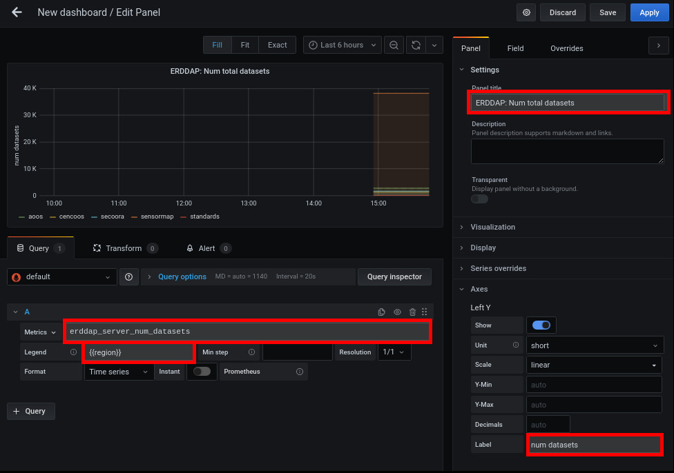

# Tutorial: setting up erddap-metrics with Prometheus and Grafana


## Background: Prometheus and Grafana

### Prometheus

From the docs:

> Prometheus is a monitoring platform that collects metrics from monitored targets by scraping metrics HTTP endpoints on these targets

**Let's break this down:**

> Prometheus is a monitoring platform

Prometheus is a tool for monitoring existing systems. Since it stores a history of metrics, you can see trends over time.
There are existing "plugins" (exporters) that let you monitor just about anything, from a linux server to a Postgres database.
And if it doesn't exist you can write your own--like `erddap-metrics`.

> that collects metrics from monitored targets

Prometheus operates using a *pull* model, not a push model.
In other words, Prometheus periodically polls its targets and collects metrics from those systems.
You can set up these targets, and how often to poll them, in the prom configuration files.

> by scraping metrics HTTP endpoints on these targets

In other words, the Prometheus server doesn't need to know anything about its target except for the HTTP endpoint to hit.
This means the prom server and its targets can exist on completely different networks, run on different OSes, etc -- it doesn't matter so long as it can access the endpoint.

For example, even if your existing systems are running in-house, you could set up your prom and grafana servers (and thus your alerts) in the cloud to increase reliability for your monitoring.

**Why use it?**

* Open source, well-supported, active development, robust ecosystem
* Powerful query language enables rollup metrics like `rate`, `min`, `max`, etc
* Distributed architecture makes it easy to run anywhere

Axiom has been using Prometheus/Grafana to instrument and monitor our systems for a few years now.
At this point we try to instrument every new process with prom metrics so we can track what's going on and add alerts.

### Grafana

Grafana allows you to query, visualize, and alert on your metrics.
Prometheus is one possible data source, but you can also point it at other datasources, [from Postgres to JSON](https://grafana.com/grafana/plugins?type=datasource).

Similar to Prometheus, Grafana is open-source, well-supported, in active development, and has a robust ecosystem with many useful plugins.

## Set up a working example

_Note: while we're using Docker in this tutorial, each of these apps can be run without it._

Shortcuts to working examples:

* [erddap-metrics (https://erddap-metrics-example.srv.axds.co/metrics)](https://erddap-metrics-example.srv.axds.co/metrics)
* [prometheus (https://erddap-metrics-prom-example.srv.axds.co/)](https://erddap-metrics-prom-example.srv.axds.co/)
* [grafana (https://erddap-metrics-grafana-example.srv.axds.co/)](https://erddap-metrics-grafana-example.srv.axds.co/)

### Set up erddap-metrics

See the [README](https://github.com/axiom-data-science/erddap-metrics) for instructions.

There is a **working example** running at https://erddap-metrics-example.srv.axds.co/metrics


As you can see, this is a simple text result, with one metric on each line.

Here are some example metrics:

```
# HELP erddap_server_status ERDDAP Server status. [1=UP, 0=DOWN]
# TYPE erddap_server_status gauge
erddap_server_status{region="standards"} 1.0
erddap_server_status{region="sensormap"} 1.0
erddap_server_status{region="aoos"} 1.0
erddap_server_status{region="cencoos"} 1.0
erddap_server_status{region="secoora"} 1.0

# HELP erddap_server_num_datasets Total number of datasets on this server (nTotalDatasets)
# TYPE erddap_server_num_datasets gauge
erddap_server_num_datasets{region="standards"} 4.0
erddap_server_num_datasets{region="sensormap"} 38161.0
erddap_server_num_datasets{region="aoos"} 2739.0
erddap_server_num_datasets{region="cencoos"} 1284.0
erddap_server_num_datasets{region="secoora"} 1612.0
```

And explanation:
```
erddap_server_status{region="standards"} 1.0
^ metric name        ^ metric label(s)   ^ metric value
```

Let's set up Prometheus to scrape this endpoint periodically, and store the results.

### Set up Prometheus

The prom docs are a great resource. In particular, check out:

* [Quickstart](https://prometheus.io/docs/introduction/first_steps/)
* [Installation](https://prometheus.io/docs/prometheus/latest/installation/)
* [Docker instructions](https://prometheus.io/docs/prometheus/latest/installation/#using-docker)

To set up a sample prom server, first create a `prometheus.yml` config file:

```yaml
---

global:
  # how often to poll targets for metrics
  scrape_interval:     15s

scrape_configs:
  # scrape erddap-metrics
  # notes:
  #   prom will check the /metrics endpoint by default
  #   port 80 is the default http port
  #   so this is equivalent to checking http://erddap-metrics-example.srv.axds.co/metrics
  - job_name: erddap-metrics
    static_configs:
      - targets: ['erddap-metrics-example.srv.axds.co:80']
```

Then run with:
```
docker run --rm --name prom-example \
    -p 9090:9090 \
    -v $(pwd)/prometheus.yml:/etc/prometheus/prometheus.yml \
    prom/prometheus
```

Then you can go to http://localhost:9090 to see the running server.

There is a **working example** running at https://erddap-metrics-prom-example.srv.axds.co/


### Set up Grafana

See [Grafana docs](https://grafana.com/docs/grafana/latest/) for installation information.

Here's an example docker command to try it out:

```
docker run --rm --name grafana-example \
    -p 3000:3000 \
    grafana/grafana:latest
```

Then you can go to http://localhost:3000 to see the running server. Login with `admin` for the username and pass.

There is a **working example** running at https://erddap-metrics-grafana-example.srv.axds.co/
Login with `test_user` and `Erddap`. Note you can only view dashboards here, not edit them.

### Add Prometheus as a Grafana Data Source

To view Prometheus metrics in Grafana, you need to add it as a *Data Source*.

On the left-hand nav bar, choose `Configuration > Data Sources` and then click the `Add data source` button.
Choose `Prometheus`. In the `URL` box enter either `http://localhost:9090` if running locally, or `https://erddap-metrics-prom-example.srv.axds.co/` if you are using the test server.
Hit `Save and Test`


Then, you can create your first *Dashboard*. 

On the left-hand nav bar, choose `Create > Dashboard`.
Then, hit the `+ Add new panel` button.
At this point, enter a prometheus query in the `Metrics` text box. For example, `erddap_server_num_datasets`.
You should now see data in the graph. You can edit other settings to customize your graph.



You can also add *Alerts* using the Alert tab in your panel config.

For example, here's an alert that triggers whenever `erddap_server_num_failed_load_datasets/erddap_server_num_datasets*100` is over `50%`:


For more information on how to set alerts, and how to setup who gets notified when they go off, see [the Grafana docs](https://grafana.com/docs/grafana/latest/alerting/create-alerts/).

## More Resources

Prometheus has a [robust ecosystem of third-party exporters that allow you to instrument existing systems](https://prometheus.io/docs/instrumenting/exporters/).
Chances are, if you are using it, someone has written an exporter for it.

In particular, we recommend looking at:

* [node_exporter](https://prometheus.io/docs/guides/node-exporter/)
  * allows you to monitor the status of a linux host (memory usage, CPU, etc)
  * if you have access to the server running ERDDAP, you can set this up to see resource usage
* [blackbox_exporter](https://github.com/prometheus/blackbox_exporter)
  * you can set it up to monitor a set of urls. can probe HTTP, HTTPS, DNS, TCP and ICMP
  * provides metrics like: url up/down, request time, etc
  * you could use this to monitor user-facing websites, APIs, etc -- and ERDDAP too of course
